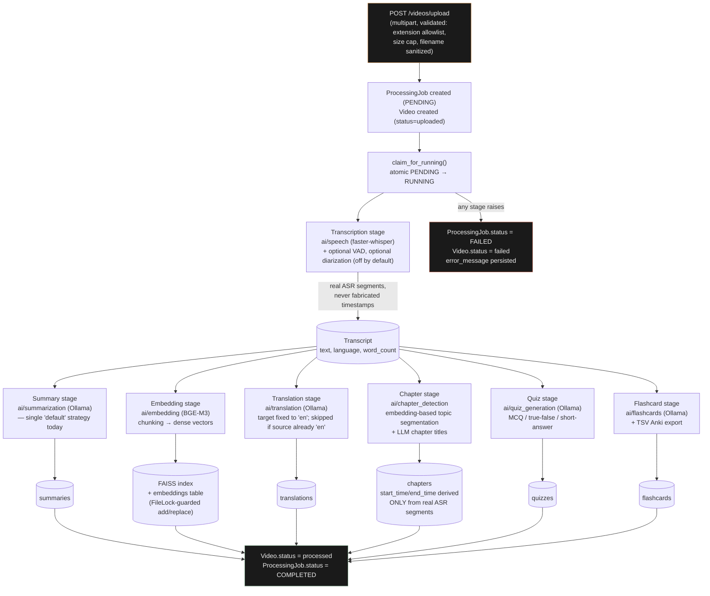

# AI Processing Pipeline

One Celery task (`app.workers.video_processor.process_video`) runs every
stage below in order, updating `ProcessingJob.progress`/`current_step` as it
goes. All stages run in a single task today — there is no per-stage retry;
a failure anywhere re-runs the whole pipeline on reprocess (see
`app/pipelines/video_pipeline.py`).

## What is intentionally NOT in this pipeline

- **Speaker diarization** (`ai/diarization`) is implemented and wired into
  the speech stage, but gated behind `SPEECH_DIARIZATION_ENABLED=false` by
  default, and has no frontend surface.
- **Knowledge graph extraction** (`ai/knowledge_graph`) is implemented as
  standalone domain logic but is deliberately never called from this
  pipeline — no table, no endpoint (see that module's own docstring for the
  rationale: computing it live would mean uncached, non-deterministic LLM
  calls per request, and persisting it is a separate, larger change).
- **Multiple summary strategies**: the schema (`Summary.type`) allows for
  more than one, but only a single "default" summarizer exists today.
