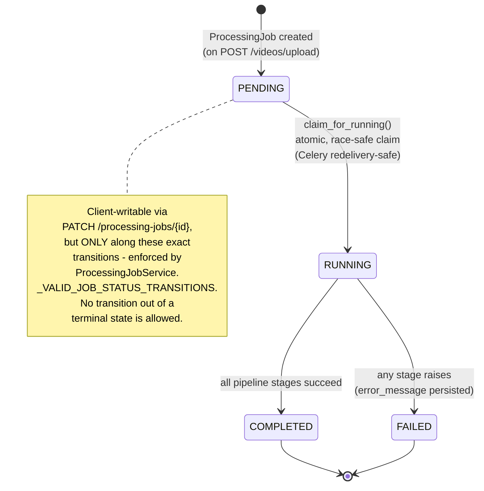
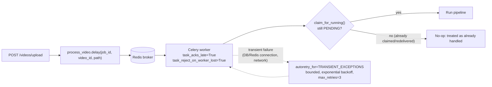

# Async Processing / Job Lifecycle

## Delivery guarantees

- **Idempotent redelivery**: `claim_for_running` is an atomic
  `UPDATE ... WHERE status='PENDING'`. If Celery redelivers a task (worker
  crash, broker requeue), a second attempt finds the job already `RUNNING`
  or terminal and safely no-ops instead of reprocessing.
- **Retry is for transport failures, not business failures**: a real
  pipeline error (bad audio, model failure) marks the job `FAILED` and
  re-raises — it is not silently retried, since retrying the exact same
  input against the exact same failure mode rarely helps.
- **Queue separation**: `celery_cpu` and `celery_gpu` are declared as
  separate queues so a GPU-equipped worker fleet can be added later
  (`docker compose --profile gpu up`) without any code change — the
  default single-worker setup consumes both.
- **Progress reporting is real, not simulated**: `ProcessingJob.progress`/
  `current_step` are updated at fixed points as each real stage starts
  (see `docs/diagrams/ai_pipeline.md`) — the frontend polls
  `GET /videos/{id}/processing-jobs` and renders exactly these values,
  never an animated fake percentage.
