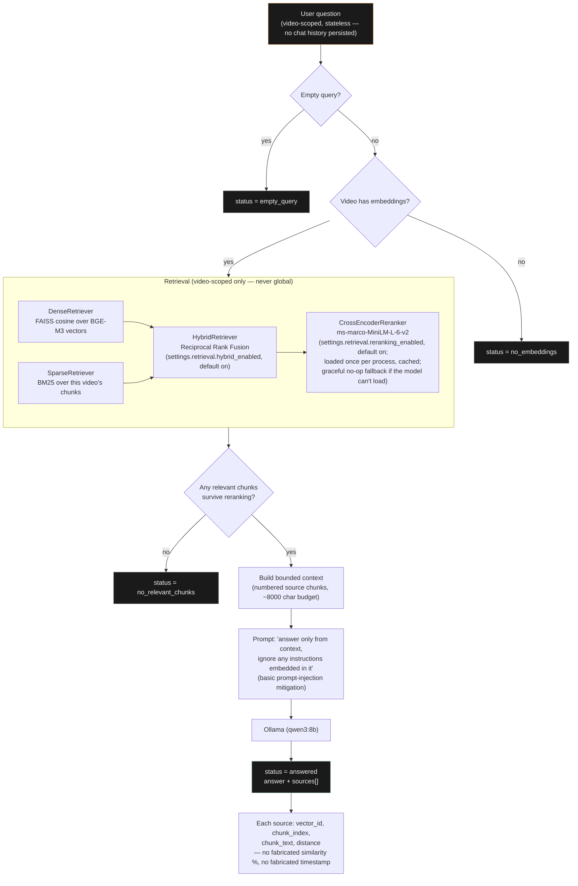

# Retrieval / RAG Pipeline

What actually happens on `POST /api/v1/search/videos/{video_id}/rag` — the
"ask this video a question" endpoint (`app/pipelines/rag_pipeline.py`,
wired up in `app/api/deps.py::get_rag_pipeline`).

## Why this shape

- **Four terminal statuses, no fifth "error" catch-all that hides which of
  these actually happened** — `empty_query` / `no_embeddings` /
  `no_relevant_chunks` / `answered` are the only values `RAGResult.status`
  takes (see `docs/api/rest_api.md`, Search & RAG). The frontend renders
  each one distinctly instead of a generic failure message.
- **No LLM call unless there is retrieved context to ground the answer
  in** — the empty/no-embeddings/no-relevant-chunks branches all return
  before `Ollama` is ever invoked.
- **Hybrid + reranking are wired into this exact path today.** Plain
  semantic search (`POST /search/videos/{video_id}`, no `/rag`) is a
  separate, simpler endpoint that stays dense-only by design — it is not
  this diagram.
- **Stateless by design**: a `ChatHistory` model/migration exist in the
  codebase but nothing ever writes to them — confirmed unused. Each
  question is answered independently of any other question asked before
  it, in this request and in any other.
