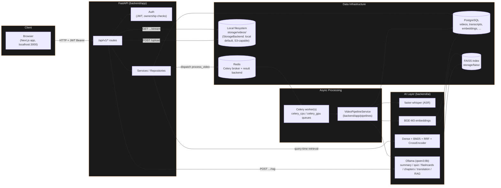

# System Architecture

## Notes

- **Two-image, one-Dockerfile split**: `api` and `celery` are the same built
  image (`Dockerfile`), started with a different `command:` — see
  `docker-compose.yml`. Both go through `backend/scripts/docker-entrypoint.sh`,
  which runs `alembic upgrade head` before starting (only for `api`; the
  Celery containers set `RUN_MIGRATIONS_ON_START=false` to avoid two
  containers racing to create the same tables on a fresh database).
- **Storage**: uploads are always written to local disk today
  (`StorageBackend` is S3-capable for the *read/stream* path via
  `STORAGE_BACKEND=s3`, but the upload write path still targets local disk
  directly — see `docs/deployment.md`).
- **The browser never talks to `redis`/`db`/Celery directly** — every
  request goes through the FastAPI process on `localhost:8001` (or through
  `nginx` in the production compose file).
